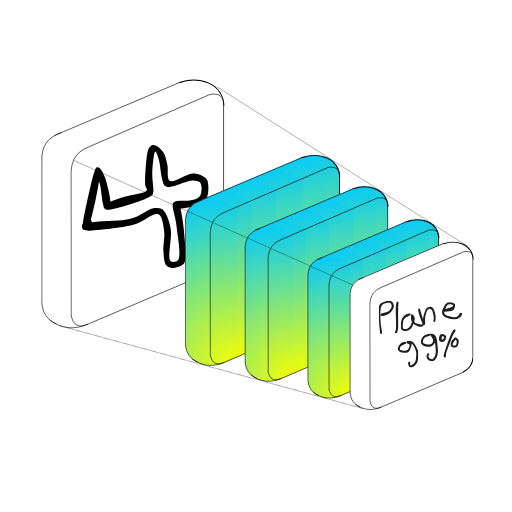
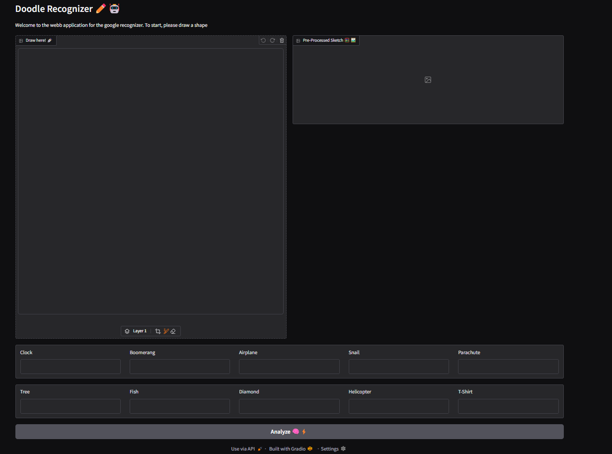
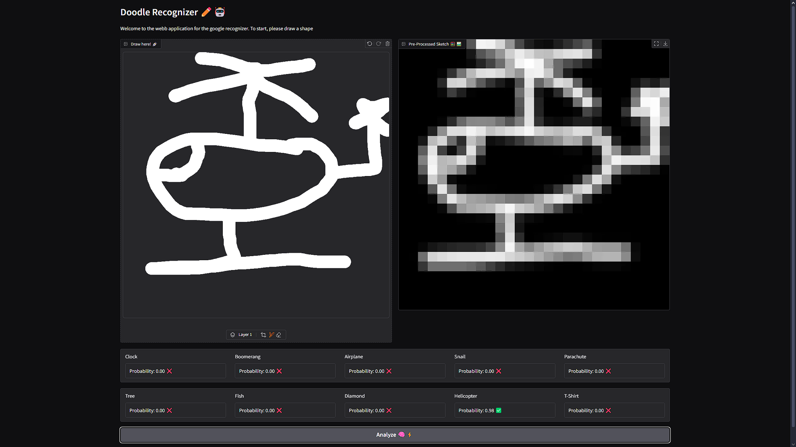
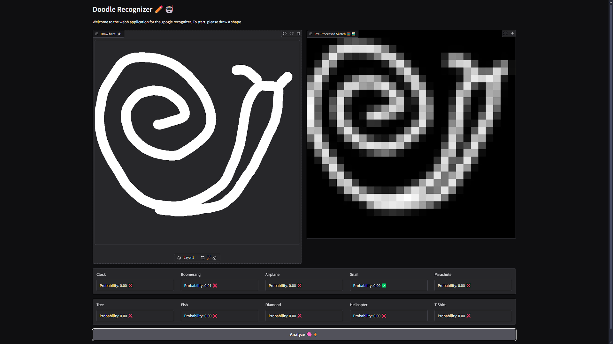
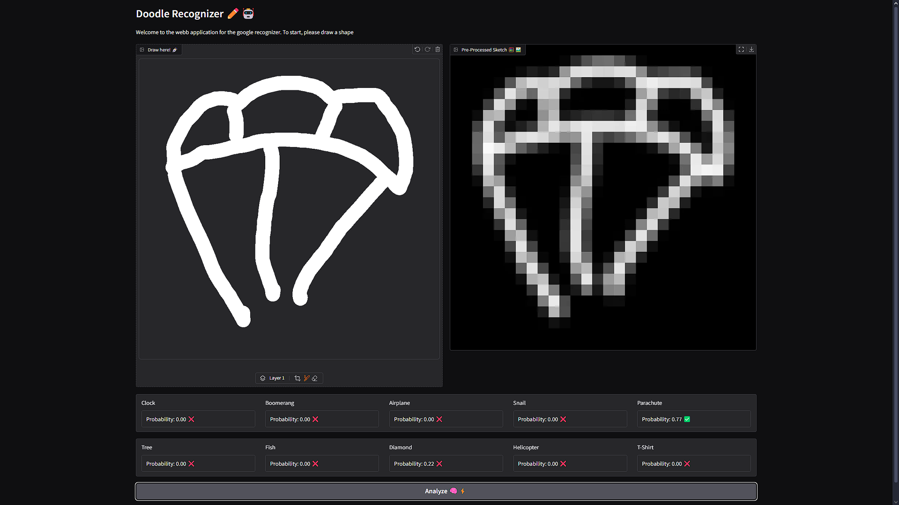

# Hand-Drawn Doodle Detection using CNNs

[](https://opensource.org/licenses/MIT)
[](https://www.python.org/downloads/)
[](https://www.tensorflow.org/)



This is a deep learning project that uses Convolutional Neural Networks (CNNs) to recognize and classify hand-drawn doodles. Built on PyTorch 2.x, this model can identify sketches across ten different categories with high accuracy.

## 🎨 Features

- One-Button doodle recognition
- Support for 10 sketch categories
- Built-in data augmentation for improved robustness
- Easy-to-use GUI
- Web interface for testing and visualization
- Comprehensive training pipeline

Coming Soon: 

- Support for more categories


## 🚀 Quick Start

### Installation

```bash
# Clone the repository
git clone https://github.com/IamTrollFace555/doodle-recognizer-with-cnns
cd doodle-recognizer-with-cnns

# Create and activate virtual environment
python -m venv venv
source venv/bin/activate  # On Windows: venv\Scripts\activate

# Install dependencies
pip install -r requirements.txt
```
### Folder Structure

```bash
.
└── doodle-recognizer-with-cnns/
    ├── media/                  # Contains images of the project (and for the README)
    │   ├── icons/                  # Project logos
    │   ├── legacy-ui/              # Images of the old UI
    │   └── ui/                     # Images of the new UI
    ├── model_module/           # Module to make predictions on the an image
    │   ├── Model.pt                # Model checkpoint
    │   └── predict.py              # Code that loads the model and makes predictions with it
    ├── web_app.py              # Gradio code for the web UI
    ├── requirements.txt        # List of necessary modules/packages
    └── README.md               # You are reading this
```


### Usage

```bash
python web_app.py
```
Once you run the command, you can check your [localhost:7860](http://localhost:7860) and you should see an interface similar to this:



Once open, you can play with it by drawing anything from the 10 categories and click the `Analyze 🧠⚡` button.

Here are some example drawings on the tool! ([See all](media/ui))

#### Helicopter



#### Snail


#### Parachute



## 📁 Dataset

The model is trained on the [Quick, Draw! dataset](https://github.com/googlecreativelab/quickdraw-dataset)
from Google Creative Lab, containing millions of hand-drawn sketches across 345 categories from 
which we selected the following ten:

- 🕒 Clock 
- 🪃 Boomerang 
- ✈️ Airplane
- 🐌 Snail
- 🪂 Parachute 
- 🌳 Tree
- 🐟 Fish
- 💎 Diamond
- 🚁 Helicopter
- 👕 T-shirt

## 🛠️ Requirements

- Python 3.9+
- Pytorch 2.x
- NumPy
- Pillow
- Gradio

(See all on the [requirements.txt](requirements.txt) file)

## 🤝 Contributing

Contributions are welcome! Please feel free to submit a Pull Request. For major changes, please open an issue first to discuss what you would like to change.

1. Fork the repository
2. Create your feature branch (`git checkout -b feature/AmazingFeature`)
3. Commit your changes (`git commit -m 'Add some AmazingFeature'`)
4. Push to the branch (`git push origin feature/AmazingFeature`)
5. Open a Pull Request

## 📝 License

This project is licensed under the MIT License - see the [LICENSE](LICENSE) file for details.

## 🙏 Acknowledgments

- [@juannico007](https://github.com/juannico007) for his help throughout the project on data curation and model training (specially on the data loading loop, which we struggled on a bit 🙃)

## 📞 Contact

 [@juannicosepulveda](https://www.instagram.com/juannicosepulveda/)

 jn.sepulveda55@gmail.com

 www.linkedin.com/in/juannicosepulveda

Project Link: [https://github.com/IamTrollFace555/doodle-recognizer-with-cnns](https://github.com/IamTrollFace555/doodle-recognizer-with-cnns)

